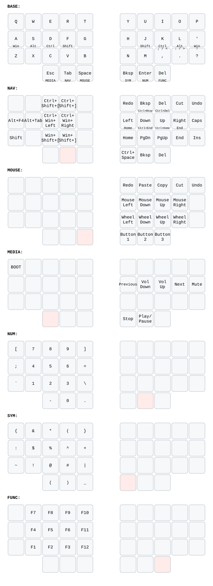
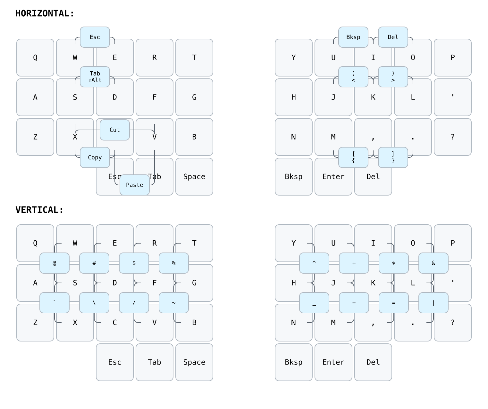

# LP36 QMK firmware

My 36-key LP36 QMK layout for Windows, inspired by
[Miryoku](https://github.com/manna-harbour/miryoku) and
[urob's ZMK config](https://github.com/urob/zmk-config).





## Layout

- Seven layers: Base, Navigation, Mouse, Media, Number, Symbol, and Function
- Bilateral Windows home-row mods with typing-flow suppression
- Six thumb layer-taps
- 31 layer-aware, prior-idle-gated combos
- Modifier-sensitive punctuation and tap-preferred navigation holds
- Mouse keys and media controls
- RP2040 BOOTSEL entry: hold the leftmost Esc/Media thumb and press `Q`

## Build

GitHub Actions builds `lp36_temper_win_work.uf2` on every push and pull request.

For a local Vial-QMK checkout, copy `keyboards/lp36` into its `keyboards`
directory and run:

```sh
qmk lint -kb lp36
qmk compile -kb lp36 -km temper_win_work
```

Enter BOOTSEL with Media+Q, then copy the UF2 to `RPI-RP2` or flash it with:

```sh
picotool load -v -x lp36_temper_win_work.uf2
```

## Keymap diagrams

The diagrams use [keymap-drawer](https://github.com/caksoylar/keymap-drawer).
Install `keymap-drawer==0.22.0`, then regenerate both checked-in SVGs with:

```sh
./scripts/render-keymap.sh
```

The QMK keymap is authoritative; the YAML files are maintained as readable
diagram sources.
